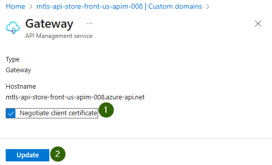

# Mutual TLS for APIs in Azure API Management


# Create the CA and server certificates

   ```bash
    $ ./deployment_scripts/gen_self_signed_certs.sh 
    Deleting old certs in directory: 'certs' 
    Verifying the client certificate.
    miztiikClient.CRT: OK

    2023-12-26 19:19:06 - Certificate creation completed. Check the log file for details: self_signed_cert_creation.log
    ---------
    Root Certificate: MIZTIIK.CER
    Client Certificate: miztiikClient.CER
    ---------
   ```

Now we have the client certificate `miztiikClient.CER` and the CA certificate `MIZTIIK.CER`.

# Create the Resources.

The bicep template will create the following resources: Azure Function App, API Management, Backend Service and the APIM Policy for configuring the backend. We have not configured the APIM to use the client certificate yet.

```bash
make all
```

## 🎯 Test the solution

We can test everything is working fine before we configure the APIM to use the client certificate.

### 🧪 Test the Azure Function App
```bash
curl https://mtls-api-store-backend-us-fn-app-007.azurewebsites.net/store-events-producer-fn
{
    "miztiik_event_processed": true,
    "msg": "Generated 1 messages",
    "resp": {
        "status": true,
        "tot_msgs": 1,
        "event_gen_duration": 3.1938037872314453,
        "bad_msgs": 0,
        "sale_evnts": 1,
        "inventory_evnts": 0,
        "tot_sales": 6215.259999999999
    },
    "headers": {
        "max-forwards": "10",
        "x-original-url": "/store-events-producer-fn",
         ...
        "was-default-hostname": "mtls-api-store-backend-us-fn-app-007.azurewebsites.net"
    },
    "count": 1,
    "last_processed_on": "2023-12-26T10:30:52.332328"
}
```
### 🧪 Test the Azure APIM
```bash
$ curl https://mtls-api-store-front-us-apim-007.azure-api.net/api/store-events-producer-fn
{
    "miztiik_event_processed": true,
    "msg": "Generated 1 messages",
    "resp": {
        "status": true,
        "tot_msgs": 1,
        "event_gen_duration": 3.195587635040283,
        "bad_msgs": 0,
        "sale_evnts": 0,
        "inventory_evnts": 1,
        "tot_sales": 1039.68
    },
    "headers": {
        "max-forwards": "9",
        "x-original-url": "/store-events-producer-fn",
        ...
        "was-default-hostname": "mtls-api-store-backend-us-fn-app-007.azurewebsites.net"
    },
    "count": 1,
    "last_processed_on": "2023-12-26T10:33:17.736201"
}
```

## Configure For Mutual TLS
We will configure the APIM to use the client certificate for the backend service. We will use the `RootCA.pfx` certificate to configure the APIM to trust the client certificate.

_For Non Consumption Tier,._



We have not updated the APIM policy to use the client certificate yet. We will do that in the next step.


```xml
<choose>
    <when condition="@(context.Request.Certificate == null  || !context.Deployment.Certificates.Any(c => c.Value.Thumbprint == context.Request.Certificate.Thumbprint))">
        <return-response>
            <set-status code="403" reason="Miztiik Says &apos;Thou Shall Not Pass&apos; - Invalid Client Certificate" />
            <set-body>{
                "error": "No or Invalid Client Certificate",
                "message": "Thou shall not pass"
            }</set-body>
        </return-response>
    </when>
</choose>
```


If you do not pass any certificate or certificate from different authority with the request you will get a `403 Forbidden` response.


```bash
curl -v https://mtls-api-store-front-us-apim-008.azure-api.net/api/store-events-producer-fn
```
As it is hard to setup curl to use a client certificate, we will use postman to test the solution.

Configure postman to use certificate in the settings,

Now we can send a request to the API and we will get a `200 OK` response.


  
1. ## 🧹 CleanUp

   If you want to destroy all the resources created by the stack, Execute the below command to delete the stack, or _you can delete the stack from console as well_

   - Resources created during [Deploying The Solution](#-deploying-the-solution)
   - _Any other custom resources, you have created for this demo_

   ```bash
   # Delete from resource group
   az group delete --name Miztiik_Enterprises_xxx --yes
   # Follow any on-screen prompt
   ```

   This is not an exhaustive list, please carry out other necessary steps as maybe applicable to your needs.

## 📌 Who is using this

This repository aims to show how to Bicep to new developers, Solution Architects & Ops Engineers in Azure.

### 💡 Help/Suggestions or 🐛 Bugs

Thank you for your interest in contributing to our project. Whether it is a bug report, new feature, correction, or additional documentation or solutions, we greatly value feedback and contributions from our community. [Start here](/issues)

### 👋 Buy me a coffee

[](https://ko-fi.com/Q5Q41QDGK) Buy me a [coffee ☕][900].

### 📚 References

1. [Azure Docs - Validate client certificate in APIM][1]
1. [Azure Docs - Secure APIs using client certificate authentication in APIM][2]
1. [Azure Docs - Add a custom CA certificate in Azure APIM][3]
1. [Azure Docs - Secure backend services using client certificate authentication in APIM][4]
1. [Azure Docs - Using Certificates in Azure APIM][5]


[1]: https://learn.microsoft.com/en-us/azure/api-management/validate-client-certificate-policy
[2]: https://learn.microsoft.com/en-us/azure/api-management/api-management-howto-mutual-certificates-for-clients
[3]: https://learn.microsoft.com/en-us/azure/api-management/api-management-howto-ca-certificates
[4]: https://docs.microsoft.com/en-us/azure/api-management/api-management-howto-mutual-certificates-for-clients
[5]: https://techcommunity.microsoft.com/t5/fasttrack-for-azure/using-certificates-in-azure-api-management/ba-p/2888447


### 🏷️ Metadata


**Level**: 300

[100]: https://www.udemy.com/course/aws-cloud-security/?referralCode=B7F1B6C78B45ADAF77A9
[101]: https://www.udemy.com/course/aws-cloud-security-proactive-way/?referralCode=71DC542AD4481309A441
[102]: https://www.udemy.com/course/aws-cloud-development-kit-from-beginner-to-professional/?referralCode=E15D7FB64E417C547579
[103]: https://www.udemy.com/course/aws-cloudformation-basics?referralCode=93AD3B1530BC871093D6
[899]: https://www.udemy.com/user/n-kumar/
[900]: https://ko-fi.com/miztiik
[901]: https://ko-fi.com/Q5Q41QDGK